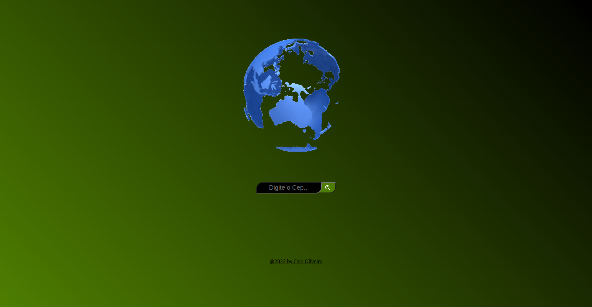

#  Create React App

Este projeto foi inicializado com [Create React App](https://github.com/facebook/create-react-app).

## Sobre

Este repositório foi criado para mostrar como podemos criar uma aplicação frontend com componentes reutilizáveis.

Vamos criar um aplicativo usando a API pública do github.

### Características

 - Pesquisar Cep
 - Apresenta endereço ligado ao CEP

### Bibliotecas

- [axios](https://www.npmjs.com/package/axios)

### Visualização

